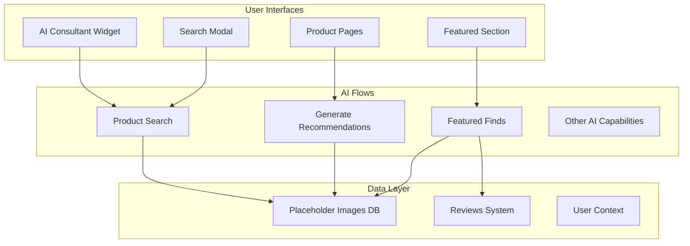
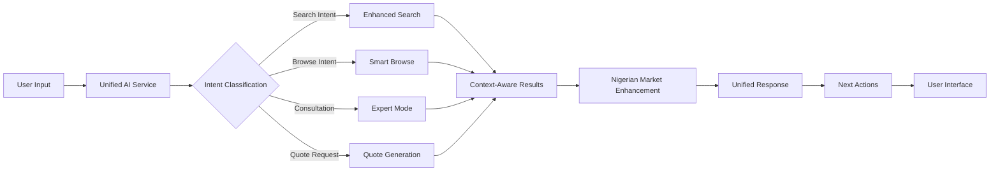

# Unified AI Implementation Strategy for Living Gold Store

## Executive Summary

This document outlines the implementation strategy for creating a unified AI service that consolidates all AI capabilities in the Living Gold lighting store platform. The approach prioritizes minimal disruption to existing functionality while significantly enhancing the user experience through intelligent orchestration of AI features.

---

## Table of Contents

1. [Current Architecture Analysis](#current-architecture-analysis)
2. [Unified AI Service Design](#unified-ai-service-design)
3. [Implementation Phases](#implementation-phases)
4. [Integration Strategy](#integration-strategy)
5. [Validation & Testing Plan](#validation--testing-plan)
6. [Risk Mitigation](#risk-mitigation)
7. [Success Metrics](#success-metrics)

---

## Current Architecture Analysis

### Existing AI Components

Based on the codebase analysis, the Living Gold platform currently has the following AI capabilities:

#### 1. **Core AI Flows**
- **Product Search** (`product-search.ts`): TF-IDF based retrieval with AI re-ranking
- **Generate Recommendations** (`generate-recommendations.ts`): Similarity-based recommendations with AI reasoning
- **Generate Featured Finds** (`generate-featured-finds.ts`): AI-curated homepage products
- **Generate Installation Guide** (`generate-installation-guide.ts`): AI-powered installation instructions
- **Generate Review Suggestion** (`generate-review-suggestion.ts`): AI-assisted review writing
- **Analyze Review Sentiment** (`analyze-review-sentiment.ts`): Sentiment analysis for reviews
- **Generate Audio Guide** (`generate-audio-guide.ts`): Audio descriptions for products
- **Enhance Image** (`enhance-image.ts`): AI image enhancement
- **Enhance Hover Animations** (`enhance-hover-animations.ts`): AI-driven animation suggestions

#### 2. **User Interface Components**
- **AI Consultant** (`ai-consultant.tsx`): Main AI interaction interface
- **AI Consultant Widget** (`ai-consultant-widget.tsx`): Floating AI assistant button
- **Search Modal** (`search-modal.tsx`): Search interface using AI capabilities

#### 3. **Current Data Flow**



### Key Findings

1. **Fragmented AI Logic**: Each AI flow operates independently with no shared context
2. **Redundant Processing**: Similar operations (like product retrieval) are duplicated across flows
3. **Limited Context Awareness**: AI doesn't maintain conversation state or user preferences
4. **No Nigerian Market Specialization**: Generic AI prompts without local market intelligence

---

## Unified AI Service Design

### Architecture Overview

The unified AI service will act as an intelligent orchestrator that:
- Maintains user context across all interactions
- Routes requests to appropriate AI capabilities
- Enhances responses with Nigerian market intelligence
- Provides consistent user experience

### Core Components

```typescript
// Unified AI Service Structure
interface UnifiedAIService {
  // Central intelligence hub
  core: {
    contextManager: ContextManager;
    intentClassifier: IntentClassifier;
    orchestrator: AIOrchestrator;
    nigerianMarketIntelligence: MarketIntelligence;
  };
  
  // Wrapped existing capabilities
  capabilities: {
    search: EnhancedSearchCapability;
    recommend: EnhancedRecommendationCapability;
    featured: EnhancedFeaturedCapability;
    consultation: ExpertConsultationCapability;
    utility: UtilityCapabilities; // Reviews, guides, etc.
  };
  
  // New unified features
  features: {
    quoteGeneration: QuoteGenerationFeature;
    whatsappIntegration: WhatsAppIntegrationFeature;
    customerInsights: CustomerInsightsFeature;
  };
}
```

### Enhanced AI Consultant Flow



---

## Implementation Phases

### Phase 1: Foundation (Week 1)

#### 1.1 Create Unified AI Service Wrapper

**File**: `src/ai/unified-ai-service.ts`

```typescript
import { productSearch } from './flows/product-search';
import { generateRecommendations } from './flows/generate-recommendations';
import { generateFeaturedFinds } from './flows/generate-featured-finds';
import { ai } from './genkit';

export class UnifiedAIService {
  private contextManager: ContextManager;
  private orchestrator: AIOrchestrator;
  
  constructor() {
    this.contextManager = new ContextManager();
    this.orchestrator = new AIOrchestrator({
      search: productSearch,
      recommend: generateRecommendations,
      featured: generateFeaturedFinds
    });
  }
  
  async process(input: UnifiedAIInput): Promise<UnifiedAIResponse> {
    // Analyze context and intent
    const context = await this.contextManager.buildContext(input);
    const intent = await this.classifyIntent(input, context);
    
    // Execute appropriate flow
    const result = await this.orchestrator.execute(intent, input, context);
    
    // Enhance with market intelligence
    const enhanced = await this.enhanceWithNigerianInsights(result);
    
    // Format unified response
    return this.formatResponse(enhanced, intent, context);
  }
}
```

#### 1.2 Context Management System

**File**: `src/ai/services/context-manager.ts`

```typescript
export class ContextManager {
  private sessionContext: Map<string, UserContext> = new Map();
  
  async buildContext(input: UnifiedAIInput): Promise<EnrichedContext> {
    const userContext = this.getUserContext(input.userId);
    const conversationHistory = this.getConversationHistory(input.sessionId);
    const marketContext = await this.getNigerianMarketContext();
    
    return {
      user: userContext,
      conversation: conversationHistory,
      market: marketContext,
      timestamp: new Date(),
      location: input.location || 'Nigeria'
    };
  }
}
```

#### 1.3 Intent Classification

**File**: `src/ai/services/intent-classifier.ts`

```typescript
export class IntentClassifier {
  async classify(input: UnifiedAIInput, context: EnrichedContext): Promise<Intent> {
    // Use AI to understand user intent
    const { output } = await ai.generate({
      model: 'googleai/gemini-1.5-flash-latest',
      prompt: `
        Classify the user intent for a luxury lighting store in Nigeria.
        
        User Input: ${input.query || JSON.stringify(input.preferences)}
        Context: ${JSON.stringify(context)}
        
        Possible intents:
        - product_search: Looking for specific products
        - browse_category: Exploring product categories
        - get_recommendation: Wants personalized suggestions
        - request_quote: Needs pricing/quote
        - expert_consultation: Needs lighting design advice
        - check_availability: Checking product availability
        - compare_products: Comparing multiple products
        
        Return the most likely intent with confidence score.
      `,
      output: { 
        schema: z.object({
          intent: z.string(),
          confidence: z.number(),
          subIntent: z.string().optional()
        })
      }
    });
    
    return output;
  }
}
```

### Phase 2: Enhanced Capabilities (Week 2)

#### 2.1 Nigerian Market Intelligence

**File**: `src/ai/services/nigerian-market-intelligence.ts`

```typescript
export class NigerianMarketIntelligence {
  async enhance(products: Product[], context: Context): Promise<EnhancedProduct[]> {
    return Promise.all(products.map(async (product) => {
      const enhancement = await this.generateNigerianInsights(product);
      
      return {
        ...product,
        nigerianInsights: {
          localAvailability: enhancement.availability,
          priceInNaira: this.formatNigerianPrice(product.price),
          powerCompatibility: enhancement.powerInfo,
          importDuties: enhancement.duties,
          deliveryTime: enhancement.deliveryEstimate,
          popularityInNigeria: enhancement.localPopularity,
          culturalFit: enhancement.culturalRelevance
        }
      };
    }));
  }
  
  private formatNigerianPrice(price: string | number): string {
    const nairaPrice = typeof price === 'string' ? parseFloat(price) : price;
    return `₦${nairaPrice.toLocaleString('en-NG')}`;
  }
}
```

#### 2.2 Enhanced AI Consultant Component

**File**: `src/components/enhanced-ai-consultant.tsx`

```typescript
export function EnhancedAIConsultant() {
  const [mode, setMode] = useState<'simple' | 'expert'>('simple');
  const [context, setContext] = useLocalStorage<UserContext>('ai-context', {});
  const unifiedAI = useUnifiedAI();
  
  const handleSubmit = async (input: ConsultantInput) => {
    const response = await unifiedAI.process({
      ...input,
      mode,
      context,
      userId: getCurrentUserId(),
      sessionId: getSessionId()
    });
    
    // Update context for future interactions
    setContext(response.updatedContext);
    
    // Display unified response
    displayResponse(response);
  };
  
  return (
    <div className="enhanced-ai-consultant">
      {/* Progressive disclosure UI */}
      {mode === 'simple' ? (
        <SimpleConsultantUI 
          onSubmit={handleSubmit}
          onUpgradeToExpert={() => setMode('expert')}
        />
      ) : (
        <ExpertConsultantUI 
          onSubmit={handleSubmit}
          context={context}
        />
      )}
      
      {/* Unified response display */}
      <UnifiedResponseDisplay />
    </div>
  );
}
```

### Phase 3: Advanced Features (Week 3)

#### 3.1 Quote Generation Integration

```typescript
export class QuoteGenerationFeature {
  async generateQuote(products: Product[], customer: CustomerInfo): Promise<Quote> {
    // Generate professional quote with Nigerian market considerations
    const quote = {
      id: generateQuoteId(),
      items: products.map(p => ({
        ...p,
        quantity: p.quantity || 1,
        unitPrice: p.price,
        totalPrice: p.price * (p.quantity || 1),
        vat: p.price * 0.075 // 7.5% Nigerian VAT
      })),
      subtotal: calculateSubtotal(products),
      vat: calculateVAT(products),
      total: calculateTotal(products),
      validUntil: addDays(new Date(), 30),
      terms: getNigerianTerms(),
      deliveryOptions: getDeliveryOptions(customer.location)
    };
    
    return quote;
  }
}
```

#### 3.2 WhatsApp Integration

```typescript
export class WhatsAppIntegration {
  async shareViaWhatsApp(content: ShareableContent): Promise<WhatsAppShare> {
    const formattedMessage = this.formatForWhatsApp(content);
    const whatsappUrl = this.generateWhatsAppUrl(formattedMessage);
    
    return {
      url: whatsappUrl,
      qrCode: await this.generateQRCode(whatsappUrl),
      message: formattedMessage
    };
  }
}
```

---

## Integration Strategy

### Backward Compatibility

All existing AI flows will continue to work during the migration:

```typescript
// Backward compatibility wrapper
export async function productSearch(input: ProductSearchInput): Promise<ProductSearchOutput> {
  // Use unified AI service if available
  if (global.unifiedAIService) {
    const response = await global.unifiedAIService.process({
      type: 'search',
      query: input.query,
      legacy: true
    });
    
    return response.legacyFormat;
  }
  
  // Fall back to original implementation
  return originalProductSearch(input);
}
```

### Progressive Migration

1. **Stage 1**: Deploy unified service alongside existing flows
2. **Stage 2**: Gradually route traffic through unified service
3. **Stage 3**: Update UI components to use enhanced features
4. **Stage 4**: Deprecate legacy flows

---

## Validation & Testing Plan

### Unit Tests

```typescript
describe('UnifiedAIService', () => {
  it('should handle search intent correctly', async () => {
    const input = {
      query: 'modern chandelier for living room',
      userId: 'test-user'
    };
    
    const response = await unifiedAI.process(input);
    
    expect(response.intent).toBe('product_search');
    expect(response.products).toHaveLength(4);
    expect(response.products[0]).toHaveProperty('nigerianInsights');
  });
  
  it('should maintain backward compatibility', async () => {
    const legacyResponse = await productSearch({ query: 'chandelier' });
    expect(legacyResponse.results).toBeDefined();
  });
});
```

### Integration Tests

- Test all user journeys work with unified service
- Verify context persistence across sessions
- Validate Nigerian market enhancements
- Ensure performance meets targets

### A/B Testing

- Compare conversion rates between legacy and unified AI
- Measure user engagement with enhanced features
- Track error rates and fallback usage

---

## Risk Mitigation

### Technical Risks

1. **Performance Degradation**
   - Mitigation: Implement caching and lazy loading
   - Monitoring: Track response times and set alerts

2. **AI Service Failures**
   - Mitigation: Graceful fallbacks to legacy flows
   - Monitoring: Error rate tracking and automatic rollback

3. **Context Data Growth**
   - Mitigation: Implement context pruning and archiving
   - Monitoring: Database size and query performance

### Business Risks

1. **User Confusion**
   - Mitigation: Gradual feature rollout with clear communication
   - Monitoring: User feedback and support tickets

2. **Feature Adoption**
   - Mitigation: In-app tutorials and highlights
   - Monitoring: Feature usage analytics

---

## Success Metrics

### Technical Metrics

- **Response Time**: < 2s for AI responses (currently ~3s)
- **Cache Hit Rate**: > 70% for repeated queries
- **Error Rate**: < 1% for AI operations
- **Uptime**: 99.9% availability

### Business Metrics

- **User Engagement**: 40% increase in AI consultant usage
- **Conversion Rate**: 25% improvement in quote requests
- **Average Order Value**: 20% increase through better recommendations
- **Customer Satisfaction**: 4.5+ star rating for AI features

### User Experience Metrics

- **Task Completion Rate**: 80% of users find products successfully
- **Time to Purchase**: 30% reduction in decision time
- **Feature Discovery**: 60% of users try advanced features
- **Return Usage**: 70% of users return to use AI features

---

## Next Steps

1. **Review & Approval**: Get stakeholder approval on this strategy
2. **Environment Setup**: Prepare development and staging environments
3. **Team Alignment**: Brief development team on implementation plan
4. **Begin Phase 1**: Start with unified service wrapper implementation

---

## Appendix

### Code Structure

```
src/
├── ai/
│   ├── unified-ai-service.ts          # Main unified service
│   ├── services/
│   │   ├── context-manager.ts         # User context management
│   │   ├── intent-classifier.ts       # Intent classification
│   │   ├── ai-orchestrator.ts         # Flow orchestration
│   │   └── nigerian-market-intelligence.ts
│   ├── features/
│   │   ├── quote-generation.ts
│   │   ├── whatsapp-integration.ts
│   │   └── customer-insights.ts
│   └── flows/                          # Existing flows (wrapped)
├── components/
│   ├── enhanced-ai-consultant.tsx     # New unified UI
│   └── ai-consultant.tsx              # Existing (backward compatible)
└── hooks/
    └── use-unified-ai.ts              # React hook for unified AI
```

### Migration Checklist

- [ ] Create unified AI service structure
- [ ] Implement context management
- [ ] Build intent classifier
- [ ] Create orchestrator
- [ ] Add Nigerian market intelligence
- [ ] Update AI consultant component
- [ ] Implement backward compatibility
- [ ] Add comprehensive tests
- [ ] Deploy to staging
- [ ] Conduct A/B testing
- [ ] Monitor metrics
- [ ] Full production rollout

This implementation strategy ensures a smooth transition to a unified AI service while maintaining all existing functionality and significantly enhancing the user experience with Nigerian market-specific intelligence.